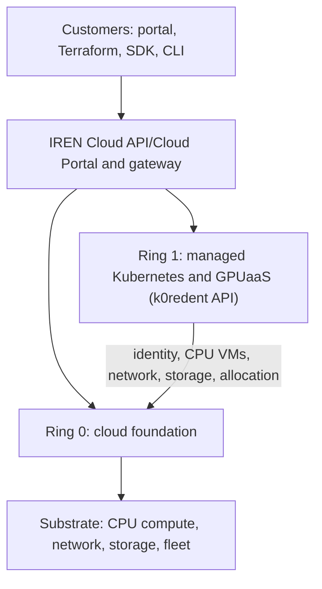
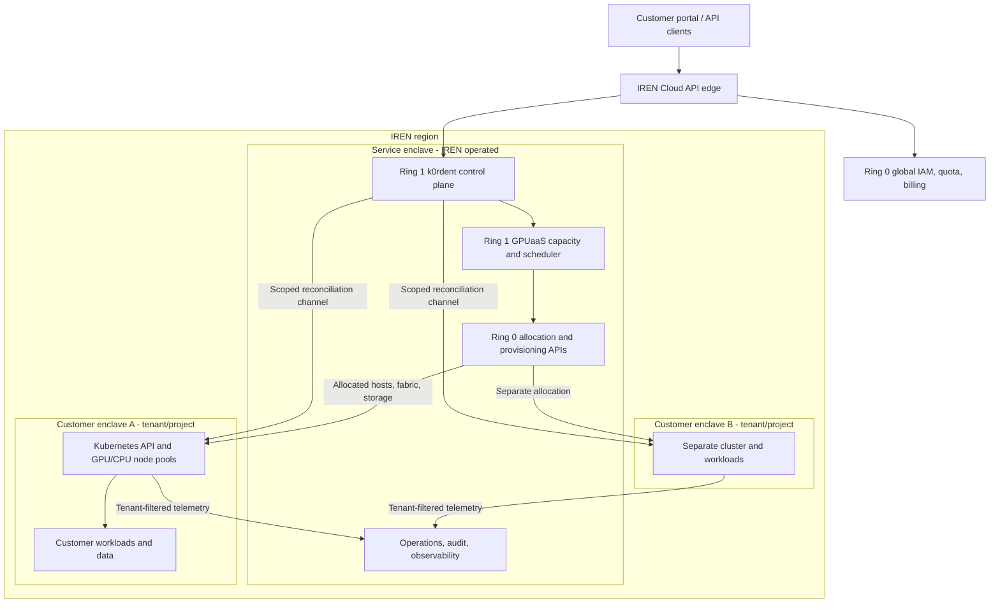
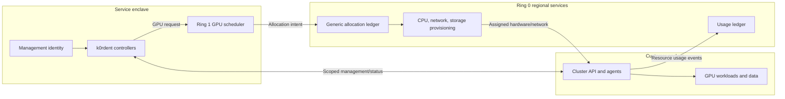
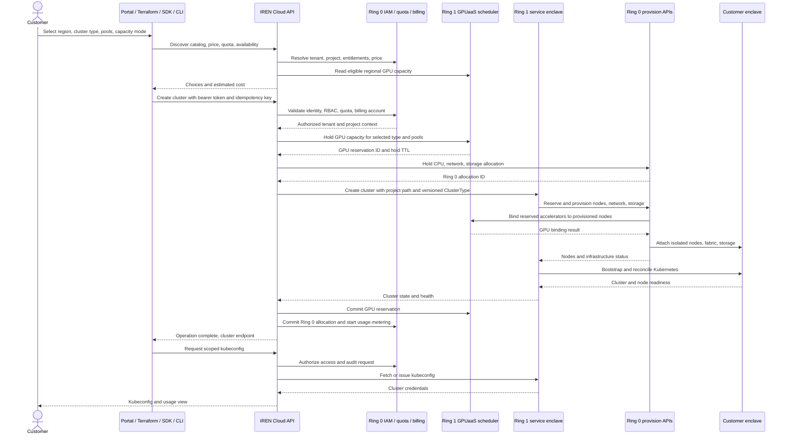

# IREN AI Cloud: Managed Kubernetes on GPU infrastructure

**Product proposal | 28 September 2026**

## 1. Offering and customer experience

IREN AI Cloud offers GPU infrastructure through one IREN account, project, region, API, and billing. Managed Kubernetes and GPU as a service are Ring 1 services built on the Ring 0 cloud substrate primitives. A customer selects a curated Kubernetes cluster type, sets GPU and CPU node pool counts, chooses a region and commercial capacity mode, and creates a cluster through the portal, Terraform, CLI, or SDK. IREN handles allocation, bare metal provisioning, cluster reconciliation, health reporting, and lifecycle operations. The customer receives a scoped cluster view and kubeconfig when ready, all orchestrated through Mirantis K0redent AI Control Plane.

The initial product serves reserved managed clusters, consistent with the attached strategy deck's Q1 2027 AI Cloud and phased rollout. A limited on-demand capacity pool can follow as a controlled beta. Dedicated inference endpoints and shared token services belong to later phases and should not be implied by this cluster launch.

**Customer journey:** discover regions and eligible cluster types with price and available capacity; preview quota pre assigned to a customer tenancy; create a project-scoped cluster; follow a durable operation to readiness; obtain kubeconfig; scale or delete; inspect usage, charges, and audit events. Terraform, CLI, SDK, and portal call the same public IREN Cloud API contract. This aligns to how every customer of CSPs consume cloud today as is expected.

## 2. Ring 0: the cloud substrate

**Ring 0 is the foundation of the cloud.** It supplies the shared, dependable building blocks that every higher-level service uses to establish identity, allocate resources, connect systems, store data, and recover from failure. Its interfaces and operational state must remain available even when an individual managed Kubernetes or GPU service is degraded. An outage or compromise here can affect every tenant and every Ring 1 product, so Ring 0 has the strongest isolation, change controls, disaster recovery, and security requirements in the platform. A highly available 

| Ring 0 building block | Foundation capability |
| --- | --- |
| Identity and governance | Tenant and project directory, authentication, IAM/RBAC, service identities, policy and quota enforcement, audit trail |
| CPU compute | CPU virtual machines and their images, lifecycle, placement, and host recovery; CPU resources for platform and tenant services |
| Storage | Block volumes, snapshots and backup, shared file storage, encryption and key management |
| Network | Private networks, routing, IP address management, DNS, firewalls/security groups, load balancing, private service connectivity |
| Resource and operations substrate | Regional inventory, generic capacity ledger, allocation IDs, infrastructure provisioning, configuration/secret management, monitoring, logging, incident and recovery controls |
| Commercial foundation | Account entitlements, base metering ledger, billing identity and charge attribution used by higher-level products |

**Availability objective:** design the critical Ring 0 control services toward **99.9999% availability (six nines)**, which corresponds to about 31.5 seconds of unavailable time in a 365-day year. This is a proposed engineering target, not a claim that every component currently meets it or a blanket customer SLA. Define a measurable SLI, failure domain, maintenance treatment, and recovery objective for each service; use redundant regional instances and tested failover so a single management failure does not interrupt running tenant workloads. Prioritize identity, network, storage, and allocation integrity because their failure or compromise propagates upward.

**Ring boundary:** physical GPU hosts and fabric are assets in the underlying fleet, but the customer-facing **GPU as a service product belongs to Ring 1**. Its GPU-specific inventory view, topology-aware placement policy, reservations, GPU lifecycle, and product usage records use Ring 0 identity, network, storage, generic allocation/provisioning, and metering foundations. Managed Kubernetes is another Ring 1 product and consumes the GPU service when its node pools need accelerators. This distinction keeps generic cloud primitives in Ring 0 and specialized GPU products in Ring 1.

## 3. Ownership and dependency



| Layer | Product responsibility | Interfaces and state |
| --- | --- | --- |
| IREN AI Cloud Console | Stable public API, portal, Terraform provider, SDK, CLI, authentication, rate limits, operation tracking | Customer tenant and project context; no direct customer access to provider internals |
| Ring 0 governance | Organizations/tenants, projects, identity, IAM and RBAC, policy, quotas, audit | Authoritative tenant-to-project membership and permissions |
| Ring 0 commercial | Account entitlements, base metering ledger, billing identity, rating and invoices | One source of truth for billable allocation and usage events |
| Ring 0 infrastructure | CPU VMs, generic regional inventory and allocation ledger, provisioning, network, block/shared storage, server lifecycle | Atomic allocation IDs and hold/commit/release; host status |
| Ring 0 schedulers | Compute provisioning engine integrated to RedFish APIs from compute BMCs | Atomic capacity fetching and compute CRUD |
| Ring 1 GPUaaS | GPU product catalog and prices, GPU-specific capacity and topology scheduler, commitments, GPU reservation lifecycle, GPU usage records | Admits accelerator requests, binds physical GPUs through Ring 0 provisioning, reports usage to the base ledger |
| Ring 1 k0rdent service | Multi-tenant Kubernetes control plane, cluster type catalog, cluster lifecycle, node pools, kubeconfigs, service templates, observability | Tenant-isolated cluster reconciliation and mapping to CPU allocations and Ring 1 GPU allocations |

**Dependency rule:** managed Kubernetes cannot promise a cluster or scale event until Ring 0 admits identity, quota, CPU/network/storage allocation and the Ring 1 GPU service admits any required accelerator capacity. Ring 0 owns the foundational asset and billing ledgers. GPUaaS owns accelerator placement and the GPU product lifecycle. k0rdent owns Kubernetes desired state and reports actual bindings and lifecycle status. Stable allocation and operation IDs prevent retries from creating duplicate reservations or charges.

## 4. Service enclave and customer enclave architecture

An **IREN AI Cloud service enclave** is the operator-controlled, regional management environment. It hosts the IREN API integration, Ring 1 k0rdent controllers, the Ring 1 GPU capacity service, and management state required to reconcile customer clusters. It is a shared service with strict logical tenant boundaries; its management credentials and infrastructure APIs remain inaccessible to customers. The global Ring 0 identity and billing services can be deployed centrally and reached through private service links, while regional GPU placement and foundational provisioning stay close to the fleet.

A **customer enclave** is the isolated project and region runtime boundary for a customer's managed Kubernetes cluster and workloads. It contains the customer Kubernetes API endpoint, its worker nodes, and assigned network and storage resources. A customer with stronger isolation needs can receive dedicated nodes and a dedicated network segment. The precise placement of a hosted Kubernetes control plane is a deployment choice: it may run in the service enclave with a tenant-scoped endpoint or in dedicated customer resources, provided that ownership, isolation, and access rules below remain the same.



The diagram expresses product boundaries, not a required physical network topology. There is no customer-enclave-to-customer-enclave route. The service enclave may manage several customer enclaves but must enforce project and cluster scope on every controller action and telemetry query.

| Boundary | Allowed interaction | Enforcement and ownership |
| --- | --- | --- |
| Customer to IREN API | OIDC-authenticated portal/API requests; authorized kubeconfig retrieval | Ring 0 IAM derives tenant/project from the token and authorizes each operation; IREN edge audits it |
| Ring 1 to Ring 0 infrastructure | Generic allocation hold/commit, CPU VM and network/storage provisioning, release, health | Service identity with least-privilege regional and allocation scope; Ring 0 owns foundational asset and allocation records |
| k0rdent to GPUaaS | GPU quote/hold, topology placement, reservation, node attachment | Ring 1 GPUaaS owns accelerator admission and placement; k0rdent owns cluster reconciliation |
| Service to customer enclave | Cluster reconciliation, bootstrap, upgrades, health, managed add-ons through a narrow management channel | Per-cluster identity, mutual TLS or equivalent authenticated transport, explicit network policy; no broad shared admin credential |
| Customer to cluster | Kubernetes API and workload traffic through approved tenant endpoints | Tenant-owned Kubernetes RBAC and network policy; no access to IREN management APIs |
| Customer enclave to service telemetry | Health and usage records with tenant, project, cluster, allocation, and region IDs | Ring 1 reports product usage to the Ring 0 ledger; service observability enforces tenant-scoped read access and retention |

**Control path and data path:** A customer create request goes through the IREN edge to the service enclave. The GPU service admits accelerator capacity, Ring 0 allocates and provisions foundational resources, and k0rdent reconciles the cluster in the customer enclave. Customer workloads and their data remain in the customer enclave's assigned resources. The management channel carries configuration and status, while metering exports the minimum resource and time records needed for billing. Customer application payloads are outside the ordinary billing path. This separation is a proposed IREN architecture requirement, not a guarantee supplied by the k0rdent API specification.



**Placement and recovery:** Record `tenantId`, `projectId`, `region`, `clusterId`, and `allocationId` on both sides of the boundary. A cluster's desired configuration and GPU placement state persist in Ring 1; Ring 0 retains the foundational allocation and billing ledgers. If the service enclave becomes unavailable, running customer workloads should continue on their allocated nodes, while create/scale/upgrade operations pause until control-plane recovery. Recovery reconciles actual clusters and GPU bindings against Ring 0 allocation and billing state before replaying operations. This continuity target requires validation for the chosen hosted-control-plane topology.

## 5. IREN Cloud API shim

The public API is an IREN-owned facade, for example `https://api.cloud.iren.com/v1`. Its purpose is to add tenancy, commercial policy, and capacity admission while translating a customer request into the k0rdent AI cluster contract. The paths and payload below are **proposed IREN interfaces**, not Mirantis endpoints.

| IREN public operation | IREN behavior | k0rdent AI mapping |
| --- | --- | --- |
| `GET /v1/regions` | Filter regions available to the tenant | `GET /v1/regions` |
| `GET /v1/regions/{region}/kubernetes/cluster-types` | Add price, capacity mode, available quantity, and eligibility to curated types | `GET /v1/regions/{region}/compute/cluster-types`; get a specific version if pinned |
| `POST /v1/tenants/{tenantId}/projects/{projectId}/regions/{region}/kubernetes/clusters` | Authenticate, authorize, check quota and billing account, hold capacity, create durable operation | `POST /v1/regions/{region}/projects/{project}/compute/clusters` |
| `GET /v1/.../clusters/{clusterId}` and `GET /v1/operations/{operationId}` | Return normalized state, health, errors, and progress | Cluster GET and IREN operation state |
| `POST /v1/.../clusters/{clusterId}:scale` | Recheck quota/capacity and reconcile billing allocation | `POST /v1/regions/{region}/projects/{project}/compute/clusters/{id}/scale` |
| `GET /v1/.../clusters/{clusterId}/kubeconfig` | Check scoped permission, issue short-lived access, audit retrieval | k0rdent kubeconfig list/download operations |
| `DELETE /v1/.../clusters/{clusterId}` | Deprovision, settle usage, release GPU reservation and Ring 0 resources | k0rdent cluster DELETE, GPUaaS release, and Ring 0 release |

The path's `tenantId` is a resource selector, **never an authority claim**. The edge validates the OIDC/JWT bearer token, derives its subject and tenant memberships, authorizes the project and region, and rejects mismatches. It injects trusted `tenantId`, `projectId`, `region`, principal/service identity, correlation ID, and billing account into internal context. It uses a scoped service credential or token exchange to call k0rdent. Customer bearer tokens must not be blindly forwarded to the Ring 1 control plane. A one-to-one mapping table links IREN project IDs to k0rdent project IDs and tenant namespace/organization context, with access checks on every read and mutation.

### Proposed request and translation

Examples

```json
POST /v1/tenants/ten-acme/projects/proj-ml/regions/us-texas-1/kubernetes/clusters
Authorization: Bearer <customer-access-token>
Idempotency-Key: 2c2719d4-7d0b-4b02-a4a8-71a4fb98e982

{
  "name": "training-a",
  "clusterTypeId": "ct-gpu-training",
  "clusterTypeVersionId": "<version-uuid>",
  "capacityMode": "reserved",
  "reservationId": "res-acme-01",
  "nodePools": [
    {"id": "gpu-workers", "nodeCount": 8},
    {"id": "cpu-workers", "nodeCount": 3}
  ],
  "auditPolicy": "default",
  "tags": {"environment": "production"}
}
```

The shim resolves the chosen catalog entry to its versioned `clusterType` URL, validates pool IDs and bounds against that version, and translates to the published `ClusterCreateRequest`: `id`, `clusterType`, `nodePools`, `auditPolicy`, and `tags`. Region and project become upstream path parameters. `tenantId`, token, capacity mode, and reservation stay in IREN's authenticated metadata and the Ring 1 GPUaaS / Ring 0 allocation workflows; they are **not** extra fields in the strict k0rdent create body. GPU model, GPU count per node, CPU, memory, networking, storage, and Kubernetes version are determined by the curated `ClusterType` and its node pools. Customers vary supported pool counts; arbitrary hardware or Kubernetes configuration requires a new approved type/version. The spec marks request `kubernetesVersion` deprecated and ignored.

The public create returns `202 Accepted` with an IREN operation ID and cluster ID. Internally, the k0rdent create API returns `201` for an asynchronously initiated cluster. IREN translates provider states (`creating`, `active`, `failed`, etc.) into its operation status and does not claim ready until both the Kubernetes control plane and required node pools pass readiness. A repeat with the same idempotency key returns the same operation. If k0rdent creation fails, the saga releases the GPU reservation and Ring 0 hold; ambiguous timeouts trigger reconciliation by IDs before any retry.

**Contract detail:** upstream scale accepts absolute desired counts for listed node pools, all in one direction, only when the cluster is `active`. Preserve its `409` busy/quota and `422` invalid target semantics in IREN's error model. Capacity admission can also return an IREN `capacity_unavailable` error before forwarding. The published specification's internal reservation and machine type operations are provider operations, not customer APIs. Ring 1 GPU availability/holds and the Ring 0 foundational allocation and billing/metering interfaces in this proposal are new IREN contracts; the reviewed spec does not define dedicated endpoints for them.

## 6. Ring 0 / Ring 1 internal contracts

| Contract | Request or event | Owner and guarantee |
| --- | --- | --- |
| GPU quote and hold | Region, tenant/project, type version, GPU pools, topology, capacity mode, reservation ID, TTL, idempotency key | Ring 1 GPUaaS checks GPU stock and commitment; returns GPU reservation ID and expiration |
| Foundational allocation | GPU reservation ID, tenant/project, CPU/network/storage needs, idempotency key | Ring 0 checks quota and generic resource availability; returns allocation ID atomically |
| Commit and release | GPU reservation ID, Ring 0 allocation ID, cluster ID, exact provisioned nodes | GPUaaS commits/releases accelerator reservation; Ring 0 commits/releases foundation resources and billable allocation |
| Provision and reconcile | Allocation IDs, machine/network/storage intents and lifecycle events | Ring 0 provisions foundation resources; GPUaaS binds accelerators; k0rdent attaches nodes and reconciles desired state |
| Usage and charge events | Tenant, project, region, cluster, node/accelerator type, timestamps, allocation IDs, meter version | Ring 1 emits product usage; Ring 0 ledger deduplicates and rates against effective price |
| Security and audit | Principal, service identity, policy decision, action, target, trace ID | Ring 0 IAM authorizes; both rings emit tenant-scoped audit records |

Provisioning must account for GPU topology and network fabric placement. The published k0rdent AI API includes internal reservation lifecycle operations; the integration may adapt these behind the Ring 1 GPU service. Ring 0 remains authoritative for foundational allocations and the billable ledger. One physical GPU allocation must have one GPUaaS reservation linked to one Ring 0 allocation record.

## 7. End-to-end customer deployment flow



On rejection or failure, the operation records the reason, releases uncommitted GPU and Ring 0 holds, and exposes retry guidance. Deletion waits for node release before stopping usage. A reconciliation loop compares Ring 0 allocations, GPU reservations, k0rdent cluster/node state, and metering records to repair partial failures.

## 8. Delivery slices and acceptance

1. **Foundation:** tenant and project mapping; token exchange; regional catalog; IAM/RBAC and quotas; Ring 0 generic allocation hold/commit/release; Ring 1 GPU capacity service; billing account and metering IDs; audit. Prove cross-tenant denial, retry safety, and allocation accounting.
2. **Reserved managed Kubernetes:** curated versioned cluster types; create/list/get/delete, status, kubeconfig, limited scale; portal plus documented API, Terraform, CLI, and SDK; usage and charges by project. Prove a cluster can be provisioned, accessed, scaled, and torn down without leaked capacity or duplicate billing.
3. **Controlled on-demand beta:** capped regional pool, live availability, pricing and spend controls. Expand only when scheduling, GPU fabric behavior, utilization, and support operations meet agreed thresholds.

The product should report time to ready, successful provisioning and scale rates, allocated versus available GPUs by region, orphaned allocation count, metering reconciliation variance, tenant isolation incidents, and support resolution time. Separate readiness and billing state to keep failure handling honest.

## Sources and design status

- Mirantis, [k0rdent AI API specification](https://docs.mirantis.com/k0rdent-AI/latest/api-specification/) and its [OpenAPI YAML](https://docs.mirantis.com/k0rdent-AI/latest/openapi/openapi.yaml), inspected 28 September 2026 (US Pacific). The schema includes ClusterType, cluster, node pool, IAM/organization/project, quota, and internal reservation operations.
- Mirantis, [k0rdent AI platform overview](https://docs.mirantis.com/k0rdent-AI/latest/), describing KCM, KSM, and KOF.
- **IREN AI Cloud Product Strategy - 0923 - Shared.pptx**, supplied by the user: slides 9–14 and 18 inform the phased managed cloud scope and roadmap. Internal strategy material; this proposal does not repeat its market figures.

All `api.cloud.iren.com` paths, capacity and billing contracts, status normalization, and ownership splits are proposed design decisions. The Mirantis OpenAPI describes provider capabilities and visibility, not an existing IREN implementation or delivery commitment. KSM service templates are a later extension to this initial cluster API surface unless an IREN service catalog contract is defined.
